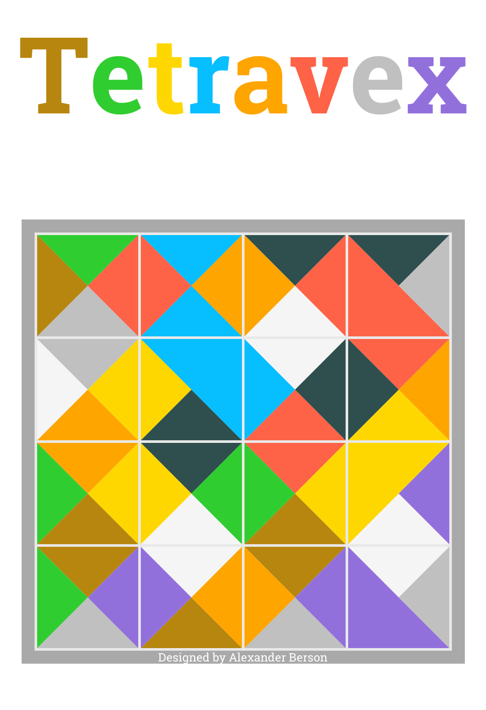

# Tetravex

Arrange the tiles so that the edges of adjacent tiles match. 
You can [play Tetravex online](https://alex-berson.github.io/tetravex/) or  

## Description

**Tetravex** is a logic-based edge-matching puzzle. The object of the puzzle is to swap the tiles on the board so that the edges of adjacent tiles have matching colors.

## Screenshot

  

## License

Copyright &copy; 2022-2024 Alexander Berson. This project is licensed under the [MIT license](LICENSE.txt "MIT License").

